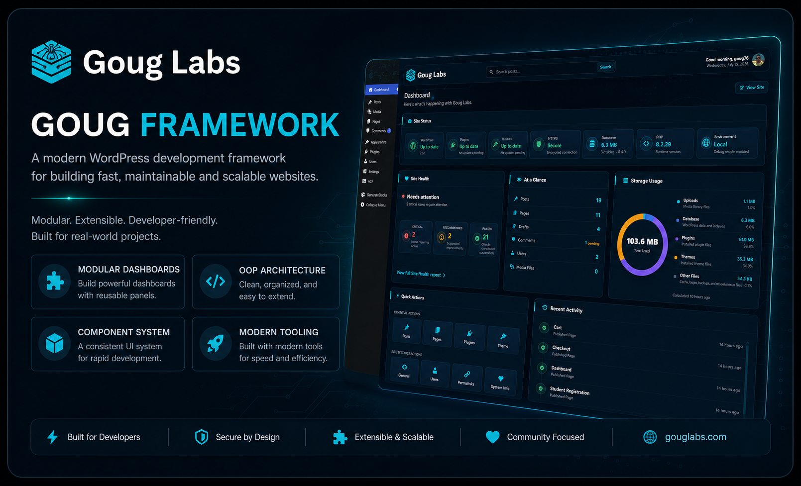
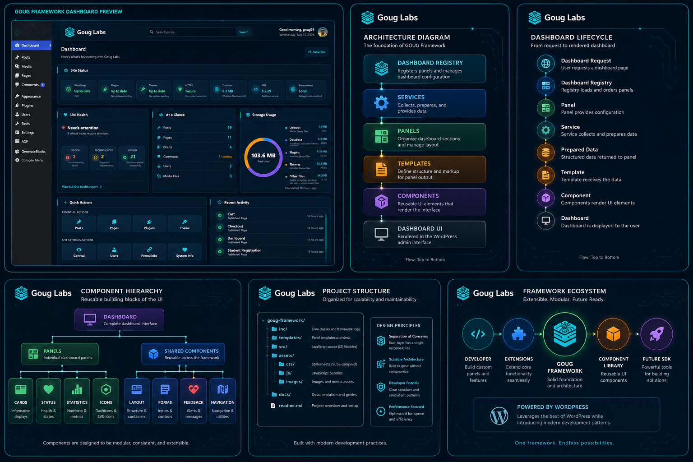

# GOUG Framework


> **A modern WordPress development framework for building fast, maintainable, and scalable websites.**

<p align="center">
    
</p>

---

## Overview

GOUG Framework is a modular development framework that brings modern software engineering practices to WordPress while remaining lightweight and familiar.

Rather than replacing WordPress, GOUG Framework extends it with a structured architecture, reusable components, an extensible dashboard framework, and a modern development workflow.

Built with performance, maintainability, and developer experience in mind, GOUG Framework provides a solid foundation for creating custom WordPress projects of any size.

---

## Features

### Dashboard Framework



- Modular dashboard architecture
- Semantic layout system
- Reusable dashboard components
- Widget-ready panel registry
- Extensible APIs

---

### Modern Architecture

- Object-oriented PHP
- Service-based architecture
- Component-driven UI
- Modern SCSS organization
- ES Module JavaScript

---

### Developer Experience

- Vite build pipeline
- SCSS compilation
- SVG icon system
- Documentation-first development
- Architecture Decision Records (ADR)

---

### WordPress First

GOUG Framework embraces WordPress instead of replacing it.

It builds on WordPress best practices while introducing modern architecture only where it improves maintainability and developer experience.

---

## Architecture

Every dashboard feature follows the same predictable lifecycle.

```text
Service
    │
    ▼
Panel
    │
    ▼
Template
    │
    ▼
Component
    │
    ▼
Dashboard
```

---

## Project Philosophy

GOUG Framework follows a few simple principles.

- Clarity over cleverness
- Single responsibility
- Three uses before abstraction
- Performance before features
- WordPress compatibility first

These principles guide every architectural decision within the framework.

---

## Documentation

Complete project documentation can be found in the `/docs` directory.

| Document | Description |
|----------|-------------|
| `ARCHITECTURE.md` | Framework architecture and design |
| `CODING-STANDARDS.md` | Development standards and conventions |
| `DASHBOARD-API.md` | Building and extending dashboard features |
| `COMPONENTS.md` | Reusable component library |
| `ROADMAP.md` | Project direction and milestones |
| `DECISIONS.md` | Architecture Decision Records |

---

## Current Status

Current Version

**v0.5.0-alpha**

The framework foundation is complete.

Current development is focused on expanding framework capabilities while preserving the architectural principles established during the initial development phase.

---

## Roadmap

Upcoming development includes:

- User-customizable dashboards
- Dashboard SDK
- Widget Framework
- Notification Center
- Command Palette
- AI integration points

See `ROADMAP.md` for additional details.

---

## License

Released under the GNU General Public License v2 or later.

---

## Author

Developed by **John Goughenour**

https://gouglabs.com