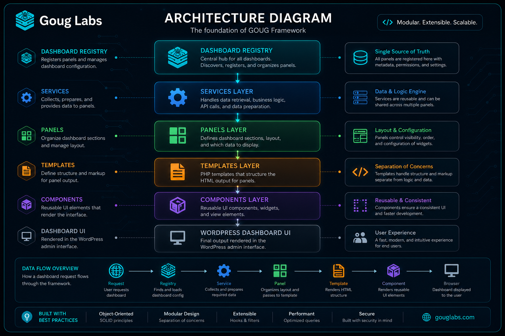

# GOUG Framework Architecture



> **Version:** 0.5.0-alpha  
> **Last Updated:** July 2026

---

# Overview

GOUG Framework is a modular WordPress development framework designed to help developers build fast, maintainable, and scalable WordPress websites.

Rather than replacing WordPress, GOUG Framework extends it by providing a structured architecture, reusable components, modern development workflows, and a cohesive administrative experience.

The framework is built around one simple philosophy:

> **Build with clarity first. Abstract only when patterns prove themselves.**

Every architectural decision within the framework is made to improve readability, maintainability, and long-term stability while remaining compatible with WordPress core and the broader plugin ecosystem.

---

# Framework Goals

GOUG Framework is designed to provide:

- A clean object-oriented architecture
- A modern developer workflow
- A modular dashboard framework
- Reusable UI components
- Consistent coding standards
- Extensible APIs
- Minimal overhead
- Excellent performance
- Strong WordPress compatibility

The framework should feel familiar to WordPress developers while introducing modern engineering practices where they add real value.

---

# Design Principles

## Clarity Over Cleverness

Readable code is preferred over clever code.

Classes should be easy to understand without requiring knowledge of the entire framework.

If future developers need several minutes to understand a class, the design should be reconsidered.

---

## Single Responsibility

Every class should have one clearly defined responsibility.

Examples:

- Services collect and normalize data.
- Panels register dashboard metadata.
- Templates render prepared data.
- Components render reusable interface elements.

Business logic should never be mixed with presentation.

---

## Proven Abstractions

GOUG Framework follows a simple rule:

> **Three uses before abstraction.**

Code is not extracted into reusable helpers simply because it *might* be reused.

Instead, reusable components are created only after patterns naturally emerge through real development.

This keeps the framework lightweight and prevents unnecessary complexity.

---

## WordPress First

GOUG Framework embraces WordPress instead of fighting it.

Whenever possible the framework uses:

- WordPress APIs
- WordPress hooks
- WordPress capabilities
- WordPress coding conventions
- WordPress security practices

The framework should always feel like an extension of WordPress—not a replacement for it.

---

## Progressive Modernization

Modern development techniques are adopted only when they improve the developer experience.

Examples include:

- Object-oriented PHP
- SCSS
- ES Modules
- Vite
- Component-based architecture

These technologies should reduce complexity rather than introduce it.

---

# High-Level Architecture

GOUG Framework is organized into several independent layers.

```text
WordPress
    │
    ▼
Framework Services
    │
    ▼
Dashboard Panels
    │
    ▼
Templates
    │
    ▼
Shared Components
    │
    ▼
Rendered Interface
```

Each layer has a single responsibility and communicates only with adjacent layers.

---

# Core Framework Layers

## Services

Services collect, calculate, and normalize data.

Responsibilities include:

- Querying WordPress
- Reading configuration
- Performing calculations
- Caching expensive operations
- Returning normalized data

Services never render HTML.

---

## Panels

Panels describe dashboard widgets.

Panels:

- register themselves
- declare metadata
- request data from services
- provide templates with prepared data

Panels do not perform business logic.

---

## Templates

Templates are responsible for presentation only.

Templates:

- receive prepared data
- validate expected values
- render HTML
- apply accessibility attributes

Templates should avoid querying WordPress directly.

---

## Shared Components

Components provide reusable interface elements shared across multiple templates.

Examples include:

- Dashboard cards
- Statistic cards
- Status indicators
- Panel wrappers
- SVG icons

Components should remain generic whenever possible.

---

# Dashboard Lifecycle

Every dashboard panel follows the same request lifecycle.

```text
Dashboard Request

        │

        ▼

Panel Registry

        │

        ▼

Panel

        │

        ▼

Service

        │

        ▼

Normalized Data

        │

        ▼

Template

        │

        ▼

Shared Components

        │

        ▼

Rendered Dashboard
```

Because every panel follows this lifecycle, new dashboard features remain predictable and easy to extend.

---

# Project Structure

```text
assets/
    images/
    icons/

inc/
    classes/
        dashboard/
        framework/
        services/

src/
    js/
    scss/

templates/
    dashboard/
    components/

docs/
```

Each directory has a clearly defined purpose.

Business logic, presentation, assets, and documentation remain separated.

---

# Asset Pipeline

GOUG Framework uses a modern asset pipeline built around Vite.

### Styles

SCSS is organized into layers:

- Tokens
- Layout
- Shared Components
- Feature Modules
- Responsive Rules

This allows common styles to remain reusable while individual dashboard modules remain isolated.

### JavaScript

JavaScript is organized into ES Modules.

Each module has one responsibility and communicates through clearly defined interfaces.

---

# Extension Philosophy

GOUG Framework is designed to grow without requiring modifications to existing code.

New functionality should be added by:

- registering new panels
- creating new services
- creating reusable components
- using WordPress hooks and filters

Core framework files should rarely require modification after release.

---

# Performance Philosophy

Performance is considered a feature.

The framework favors:

- cached calculations
- lazy loading
- reusable components
- efficient WordPress queries
- minimal database access
- minimal asset overhead

Every feature should justify its runtime cost.

---

# Security Philosophy

Security follows WordPress best practices.

The framework consistently applies:

- capability checks
- escaping
- sanitization
- nonce verification
- prepared data
- least privilege

Security should never depend on frontend behavior.

---

# Future Direction

GOUG Framework will continue expanding while preserving its architectural principles.

Future areas of development include:

- User-customizable dashboards
- Drag-and-drop layouts
- Panel visibility preferences
- Widget SDK
- Plugin extension APIs
- Notification Center
- Command Palette
- AI-powered administrative tools

Regardless of future capabilities, the framework will continue prioritizing:

- clarity
- maintainability
- performance
- extensibility
- WordPress compatibility

---

# Guiding Principle

> **Build systems that future developers enjoy working with.**

Every class, component, and feature should make the framework easier to understand than it was before.